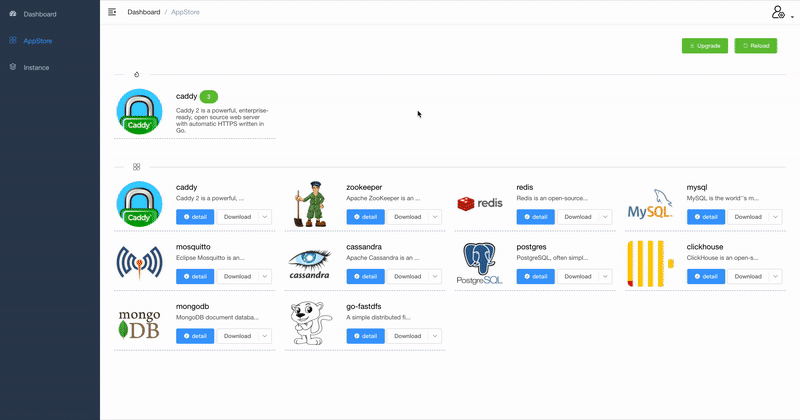

# Software Lab

The software laboratory is a SaaS application based on container technology, and all kinds of basic components can be obtained in a few simple steps

## Development

### Preparation

`Jdk1.8+`, `maven3.2+`, `Docker CE`、`Npm6.14.0+`

### Test
```
mvn test
```

### Build

* build all
```
mvn -DskipTests=true clean package
```
* build backend
```
mvn -DskipTests=true clean package -pl application -am
```
* build frontend
```
cd ui
npm run build
```

## Installation

Currently supports MacOS, Linux (CentOS), and plans to support Windows in the future

### Premise

Install java and DockerCE version

### Start

Compile the source code to get the compressed package or download the installation package directly to decompress

```

unzip softwarelab-xx.zip -d /path/to/

```

Execute start command

```

./path/to/softwarelab/bin/startup.sh

```
Open your browser ,enter the address http://ip:8080 and login, you can see a page like this:


## Use

Use a browser to open the address `http://ip:8080/`, the default username and password: ʻadmin/123456`



### Restart

```

./path/to/softwarelab/bin/restart.sh

```

### stop

```

./path/to/softwarelab/bin/shutdown.sh

```

### View log

```

tail -f /path/to/softwarelab/softwarelab-xx.log

```

### FAQ

//todo

## Future plan

//todo
